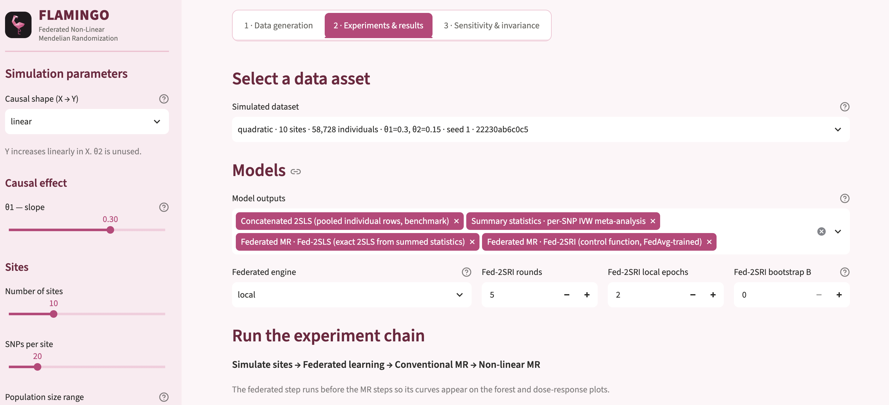
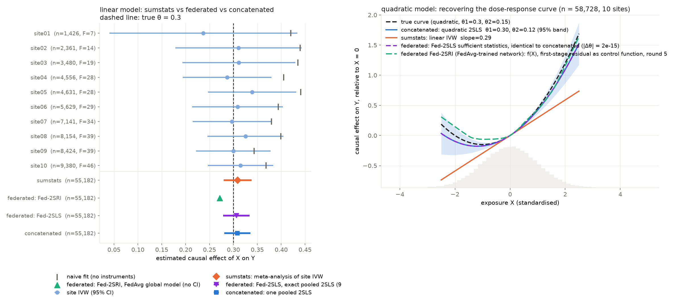

<p align="center">
  
</p>

# FLAMINGO - Federated Non-Linear Mendelian Randomization
# Purpose

The purpose of this work is to demonstrate the utility of federated learning for non-linear mendelian randomization. Here we created our own synthetic dataset to simulate learning across bio-banks and compare it with conventional MR.

# Quick Start

Requires [uv](https://docs.astral.sh/uv/) and Python >=3.12. One `uv sync` at the
root builds a single environment for the whole repository — `data/`,
`federated_learning/`, `fedmr/` and the dashboard all share it.

```bash
# 1. Clone the repo and build the environment (once)
git clone git@github.com:collaborativebioinformatics/FLAMINGO.git
cd FLAMINGO
uv sync

# 2. Simulate ten biobank sites sharing one causal curve
cd data
uv run python scripts/simulate_federated_sites.py --shape quadratic

# 3. Conventional MR: per-site summary statistics + IVW meta-analysis vs a pooled fit
uv run python scripts/federated_summary_mr.py --shape quadratic

# 4. Non-linear MR: pooled quadratic 2SLS vs the summary-statistics line
uv run python scripts/federated_nonlinear_mr.py --shape quadratic

# 5. Fed-2SLS: exact federated 2SLS from summed sufficient statistics (equals the pooled fit)
uv run python scripts/federated_exact_mr.py --all
uv run pytest -q                                   # identity tests against the pooled fits

# 6. Federated learning: NVFlare FedAvg, one simulated client per site
cd ../federated_learning
uv run python job.py --dataset quadratic

# 7. Fed-2SLS through NVFlare: two rounds, no training, checked against the pooled fit
uv run python job.py --all --method fed2sls
```

Results are written to `data/results/` and `federated_learning/results/<dataset>/`.
Fed-2SLS is described in [data/docs/federated-exact-mr.md](data/docs/federated-exact-mr.md).

# Interactive dashboard

To explore the whole pipeline without the command line — set the simulation
parameters, generate a federation, then run the federated learning and MR
workflows over it and compare every estimator side by side:

```bash
cd dashboard
uv run streamlit run app.py
```

See [dashboard/README.md](dashboard/README.md).



# Intro

Biobanks make it possible to study the causes of disease at scale, but the most informative analyses often need individual-level data, which privacy concerns usually restrict. Federated learning (FL) works around this by keeping the data in place. FL trains a model locally at each site and shares only model parameters or gradients with a central server, which combines them into a global model and sends it back for further training rounds until it converges. Mendelian randomization (MR) is a statistical method that aims to test a causal hypothesis on observational data. Standard MR estimators such as inverse-variance weighted (IVW), MR-Egger and weighted median only need the per-variant effect estimates and standard errors for the exposure and the outcome, and these summary statistics are routinely shared. For linear models, fixed-effects meta-analysis of per-site estimates is as efficient as pooling the individual-level data. This argument holds only for linear models. Non-linear MR needs individual-level data and cannot be rebuilt from standard summary statistics. It estimates how the causal effect changes across the range of the exposure, tests of gene–environment interaction, and consistently adjusts covariates across sites. For these analyses, FL is a legitimate alternative to pooling data. Here we test whether a federated two-stage MR model can recover a non-linear causal dose–response curve across biobanks that cannot share data, and compare it with summary-statistic MR and with a fit on the pooled individual-level data.

# Pipeline


The diagram is generated: edit [images/make_pipeline_diagram.py](images/make_pipeline_diagram.py) and re-run it to rebuild the SVG and PNG.

```bash
uv run python images/make_pipeline_diagram.py
```

# Results




# Further Reading

- [In-depth reasoning](indepth_reasoning.md): more detail on the methods and the reasoning behind them.
- [Fed-2SLS](data/docs/federated-exact-mr.md): exact federated one-sample MR from sufficient statistics, the protocols, the identity checks and the seed sweep; plan and review history in [data/docs/fed2sls-plan.md](data/docs/fed2sls-plan.md).
- [Robust and privacy-preserving federation](federated_learning/ROBUST_PRIVATE.md): malicious sites, what the server learns from the updates, differential privacy and secure aggregation for the federated MR second stage.
