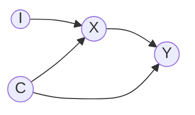

# FLAMINGO - Federated Non-Linear Mendelian Randomization

# Purpose

The purpose of this work is to demonstrate the utility of federated learning for non-linear mendelian randomization. Here we created our own synthetic dataset to simulate learning across bio-banks and compare it with conventional MR.

# Quick Start

*Placeholder* -- In Progress

# Intro

Mendelian randomization (MR) uses genetic variants as natural experiments to estimate whether an exposure (such as BMI) causes an outcome (such as heart disease). It faces the same problem as other multi-site analyses: individual-level data usually cannot leave the biobank that holds it. Unlike many other fields, MR has largely worked around this without federated learning (FL). The standard MR methods (inverse-variance weighted, MR-Egger and weighted median) do not need individual-level data. For each genetic variant they need only two numbers: its estimated effect on the exposure and its effect on the outcome, each with a standard error. Cohorts routinely publish these summary statistics. As a result, "two-sample" MR can take the exposure effects from one cohort and the outcome effects from another. When several sites each report their own estimate, combining them with a fixed-effects meta-analysis loses essentially no precision compared with pooling all the raw data, at least for linear models in large samples. Summary statistics also make differences between sites easy to measure. Random-effects models and heterogeneity statistics show how much the estimates disagree across sites, for example because of differences in ancestry, in how participants were recruited, or in how the disease was defined.

# How To Use Section

NFlare we have client code and cloud code add privacy keys and

## NVFlare

## Virtual Enviorment

##

You can run simulation to see if a federated analysis would help you.

# Try it

## Setting

| Site | SNPs `G` | Exposure `X` | Outcome `Y` | Confounders `C` |
|---|---|---|---|---|
| Biobank A | yes | yes | yes | **yes** |
| Biobank B | yes | yes | yes | no |

Causal diagram (the same at both sites):

`I` are the SNPs, `X` the exposure, `Y` the outcome and `C` the confounders of `X` and `Y`.
The instrument is `S = G·w`; it stands in `I`'s place, so the design needs `S ⊥ C`.

Biobank A uses `C` to build a polygenic risk score (PRS) `S = I·w` that predicts `X`
but is (approximately) independent of `C`. Biobank B cannot check that independence
itself, so it relies on the certificate issued by A. Only the weights `w`, the
certificate, and model parameters ever leave a site; individual-level data stays put.