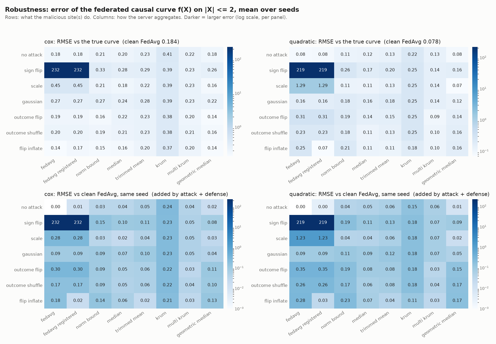
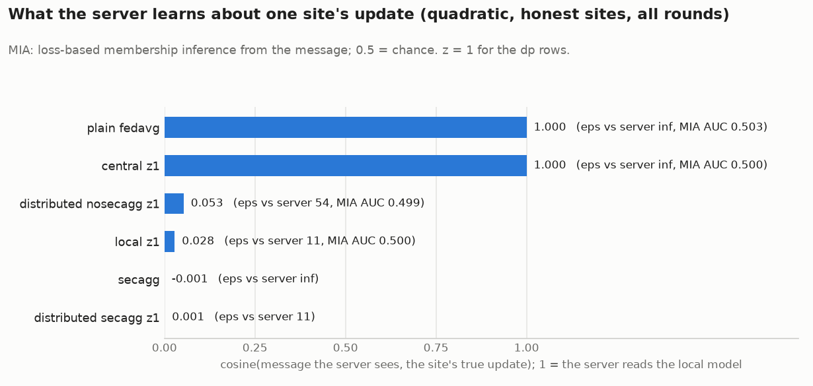
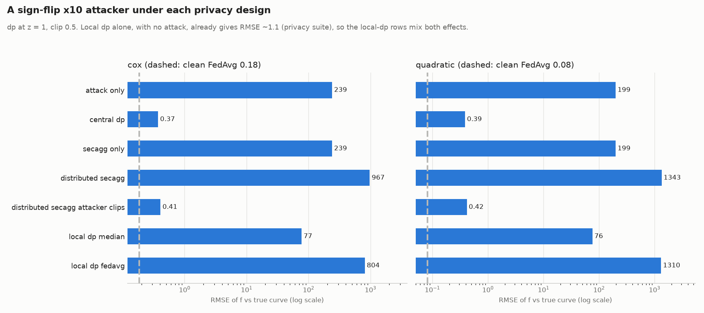

# Robust and privacy-preserving federated MR

The federated second stage in this folder is plain FedAvg: every site sends its full
model weights to the server, which averages them weighted by the sample size each site
reports. For health data that has two weaknesses:

1. **A malicious or broken site** can send any update it likes, and FedAvg averages it
   in. One site can move the global causal curve anywhere.
2. **Anyone who sees the updates** (the aggregation server, or whoever records the
   traffic) sees each site's local model after every round. That is a summary of the
   site's patients that the site never agreed to publish.

`src/fedsec/` adds defenses against both. Every component is **off by default** and
switched on from a YAML config. With everything off, `job.py` and `local_engine.py`
take their original code path. This was checked byte for byte: `metrics.csv`,
`curves.csv` and `summary.csv` for naive and 2SRI on `quadratic` and `cox` are
identical to the pre-change commit.

The data-generating mechanisms, the site-local first stage, the second-stage models,
the loss functions, the plots and everything under `results/<method>/` are unchanged.
New results go to `results/secure/`.

## Threat model

| Adversary | Can | Cannot | Defense in fedsec |
|---|---|---|---|
| Malicious site (Byzantine) | send any update; lie about its sample size; train on corrupted data; skip client-side clipping and noise | see other sites' updates or collude with the server (no omniscient attacks such as "a little is enough") | robust aggregation rules, norm bounding, registered weights, server-side DP clipping |
| Honest-but-curious server | read every message it receives; run any analysis on it | deviate from the protocol; collude with sites | secure aggregation; local or distributed DP |
| Eavesdropper on the updates | record every message | break TLS/encryption (NVFlare runs over TLS in production; here it is the same as the server's view) | same as the server |
| Anyone with the released global models | query or inspect them | see individual updates | central or distributed DP |

Not covered: the site-local first stage (it never leaves the site), the per-site test
metrics that the NVFlare Client API can report (suppressed when DP or SecAgg is on,
see A10), side channels such as timing and message size, and gradient-inversion or
multi-round reconstruction attacks beyond the two probes in `leakage.py`.

## Components

| Section | Switch | What it does | Code |
|---|---|---|---|
| `weights` | `reported` (default), `registered`, `uniform` | per-site aggregation weight: self-reported n (FedAvg's default), the training-split sizes the server holds, or 1/K | `protocol.py` |
| `attack` | `enabled` | simulated malicious site(s): `sign_flip`, `scale`, `gaussian` (model poisoning); `outcome_flip`, `outcome_shuffle` (data poisoning); `weight_multiplier` (weight inflation) | `attacks.py` |
| `defense` | `enabled` | server aggregation rule: `fedavg`, `median`, `trimmed_mean`, `krum`, `multi_krum`, `geometric_median`; optional `norm_bound` (fixed or adaptive) | `aggregators.py` |
| `dp` | `enabled` | site-level differential privacy: clip every update to `clip_norm`, add Gaussian noise; `central`, `local` or `distributed`; exact accounting | `dp.py` |
| `secagg` | `enabled` | pairwise-mask secure aggregation over fixed-point integers mod 2^64; the server learns only the sum | `secagg.py` |
| `leakage` | `enabled` | probes of what an observer of one site's message learns: cosine to the true update, membership-inference AUC | `leakage.py` |

All defaults and the per-field comments are in `src/fedsec/config.py`. Scenario files:
`configs/secure/*.yaml` (index in `configs/secure/README.md`).

### How one round runs

```
site k:   u = local - global                       true update (fedsite.Site.run_round, unchanged)
          v = attack(u)                            malicious sites, model poisoning
          v = clip(v, C)                           dp at the site (local / distributed, or any dp behind secagg)
          v = v + N(0, s_k^2)                      dp noise at the site (local / distributed)
          send v and its weight                    plain
          send mask(encode([r v, r]))              secagg: pre-weighted, fixed point, masked

server:   plain:  clip rows to C (central dp) -> norm bound -> rule(U, w)
          secagg: sum of messages -> sum r v / sum r
          + N(0, s^2)                              central dp
          global <- global + aggregate update
```

With `rule: fedavg` and nothing else on, this is FedAvg on updates:
`global + sum w_k (local_k - global) = sum w_k local_k`. Enabling only `leakage`
changes results at float rounding level (float64 deltas instead of float32 weights).

## Which combinations are allowed

`config.validate()` raises on combinations whose guarantee would not hold, rather than
quietly changing the setup:

| Combination | Result | Why |
|---|---|---|
| `secagg` + any rule other than `fedavg` | error | robust rules need the individual updates; secagg reveals only their sum |
| `secagg` + `defense.norm_bound` | error | the server cannot measure norms it cannot see; use dp (clipping then runs at the sites) |
| `dp` + `weights: reported` | error | the DP noise is calibrated to the largest weight, so the weights must be fixed in advance |
| `dp.mode: central/distributed` + a robust rule | error | accounting is for the clipped weighted sum; a median has a different sensitivity. `dp.mode: local` is allowed with any rule (post-processing) |
| `dp.mode: central/distributed` + `norm_bound` | error | `dp.clip_norm` already bounds every update |
| `dp.mode: distributed` without `secagg` | warning | each individual message carries only 1/K of the noise; `epsilon_server` shows the cost |
| Krum with K < 2f + 3, median / geometric median with >= K/2 malicious, trimmed mean trimming fewer than the malicious count | warning | the rule's robustness guarantee does not hold |

## Assumptions

Every assumption the new code makes, what it changes, and where it lives.

**A1. Only the second stage is protected.** The site-local OLS first stage (X on SNPs)
never leaves the site and is unchanged. MR identification assumptions (relevance,
independence, exclusion restriction, the linear control function for 2SRI) are exactly
those of the existing pipeline; fedsec neither adds nor relaxes any of them. It changes
*how* the second-stage updates are combined, not *what* is estimated.

**A2. Robust rules change the estimator.** FedAvg with sample-size weights is the
federated analogue of the pooled fit. A median, trimmed mean, Krum or geometric median
is a different estimator. Under heterogeneous but honest sites (here: different
first-stage strength, confounding, and sample size), these rules down-weight the sites
whose updates differ most, typically the small ones. That costs efficiency and, when
sites really differ, can add bias. The `no_attack` row of the robustness experiment
measures this cost. The rules keep the sample-size weights (weighted median, weighted
trimmed mean, weighted geometric median, weighted average of the Krum-selected set)
unless `weights: uniform`.

**A3. Coordinate-wise rules act per parameter.** Median and trimmed mean treat each of
the network's ~1,150 parameters separately, so the aggregate need not be any site's
model. Krum and the geometric median act on whole update vectors.

**A4. Honest majority / bounded attackers.** median and geometric_median assume honest
sites hold more than half the weight; trimmed_mean assumes at most `trim_fraction x K`
malicious sites; Krum assumes K >= 2f + 3. `validate()` warns when the configured
attack breaks these.

**A5. Malicious sites are non-colluding and non-omniscient.** They see only their own
data and the global model. They do not coordinate or read the honest updates. Attacks
tuned to evade a specific rule (e.g. "a little is enough" against median) are outside
this study and would give worse numbers than reported.

**A6. Attacker's own test metrics are honest.** Data poisoning changes only the
malicious site's training split; its test split stays clean. Summaries report honest
sites only.

**A7. Detection flags are per site and round.** `flagged` means the rule clipped the
site or cut its effective weight below half its nominal weight. Krum keeps one update
and so "flags" most honest sites by construction; its false-positive rate is not a
defect of the attack model. Under central DP the clipping is applied to every site and
is not counted as a flag.

**A8. Site-level differential privacy.** The protected unit is one site's whole
contribution to a round, which covers every individual in that site. Adjacency is
add/remove one site's data (a site with no data sends a zero update). Changing rather
than removing a site's data doubles the sensitivity; `privacy.json` reports that
epsilon as `*_replace`. Record-level guarantees follow from the site-level ones, since
changing one record changes only one site's data.

**A9. Accounting.** All K sites take part in every round (no subsampling, so no
amplification). T training rounds of the Gaussian mechanism compose exactly to
mu-Gaussian DP with mu = sqrt(T)/z (Dong, Roth & Su 2022), converted to (epsilon,
delta) by the exact formula; the RDP bound is looser (checked in the tests). The
weighted sum uses **fixed public weights** w_k (registered sizes or 1/K, not
renormalised when a site is absent), so its sensitivity is `max_k w_k x C` and the
noise std is `z x C x max_k w_k`. Every site gets at least the reported epsilon; small
sites get more protection. The evaluation-only final round releases no update and is
not counted.

**A10. What epsilon protects against.** `epsilon_aggregate` holds against anyone who
sees the released global models. `epsilon_server` holds against the server or an
eavesdropper who sees each site's message: it is infinite for central DP (the server
sees raw clipped updates), equal to the aggregate epsilon for local DP and for
distributed DP behind secagg, and much larger for distributed DP without secagg. In
the NVFlare engine the per-site test metrics are not sent to the server when dp or
secagg is on, since they are an unprotected side channel. They are still written to
the site's local metrics files, which job.py reads to make the tables and plots.

**A11. Distributed DP needs the honest sites' noise.** Each site adds 1/`min_honest` of
the noise variance (`min_honest` = K by default). A malicious site that skips its share
lowers the total. The accountant counts only sites that add noise, so the reported
epsilon is the one that actually holds.

**A12. Clipping bias.** Clipping honest updates to C shrinks them and slows or biases
the optimisation; it is part of the DP cost, not only the noise. C = 0.5 was chosen
from a non-private pilot run on the simulated data (honest update norms 0.3 to 2.3).
With real data C must come from public or simulated data, since tuning it on the
private updates leaks. Adaptive clipping with a private quantile is not implemented.

**A13. Public sample sizes.** With `weights: registered` and with DP, the training-split
sizes are treated as public, as biobank sizes usually are. `job.py` computes them from
the site files with the same arithmetic as the split (`n_train = n - ceil(0.2 n)`).

**A14. Secure aggregation simplifications.** Pairwise keys come from a session secret
shared by the sites, standing in for a Diffie-Hellman key agreement; the server code
never receives it. There is no dropout recovery: every site must report every round
(NVFlare's FedAvg here waits for all sites anyway). The server is honest-but-curious
and does not collude with sites. Fixed-point encoding with 24 fractional bits adds at
most 2^-25 rounding per coordinate. Behind secagg the server cannot check any weight
or norm, so a malicious site's inflated weight or unclipped update gets through
whatever the config says. The `combined` experiment shows what that costs.

**A15. Leakage probes are lower bounds.** `update_cos` and `mia_auc` measure what two
simple attacks recover from one message. A stronger attacker (several rounds,
auxiliary data, gradient inversion) may learn more. The membership-inference probe
needs a per-record loss and is not defined for the Cox partial likelihood (NaN for
survival) or for a masked message.

**A16. Randomness.** `--seed` (default 0, as before) now also seeds the attack, dp noise,
masks and the leakage subsample, each from its own stream (`numpy` SeedSequence of
[seed, stream, site]). Seed 0 with everything off reproduces the previous results.

## Running

```bash
uv run python tests/test_fedsec.py                                      # unit checks, ~5 s

# one scenario, NVFlare simulator (real federation) or the local engine
uv run python job.py --dataset quadratic --secure_config configs/secure/robust_median.yaml
uv run python job.py --dataset cox --engine local --secure_config configs/secure/dp_distributed_secagg.yaml \
    --secure_set dp.noise_multiplier=2 --secure_set name=dp_dist_z2

# the experiment suites (local engine), results/secure/experiments/<suite>/
uv run python secure_experiments.py --suite all --jobs 12              # ~5 min on 16 cores
uv run python secure_experiments.py --suite privacy --report_only      # re-plot only
```

A secure run writes `results/secure/<name>/<method>/<dataset>/` with the usual
`metrics.csv`, `curves.csv` and plots, plus:

| File | Contents |
|---|---|
| `fedsec_clients.csv` | per site and round: malicious, attacking, true update norm, sent norm, client clipping, `update_cos`, `mia_auc` |
| `fedsec_server.csv` | per site and round, as the server saw it: weight, norm, clipped, kept, share, flagged (`malicious` is ground truth, for evaluation only) |
| `privacy.json` | config, malicious sites, mu and epsilon against the aggregate and the server, adjacency |

`results/secure/{robust_median, attack_shuffle_trimmed, secagg, dp_local,
dp_distributed_secagg}/` are single runs of those configs on `quadratic` through the
NVFlare simulator, as a check that the real federation runs every component (server-side
rules and unmasking in `FedSecAggregator`, attacks, clipping, noise and masking in
`client.py`). Their initial weights differ from the local engine's, as for plain runs.

`secure_experiments.py` writes per suite `runs.csv` (one row per scenario, dataset and
seed), `summary.csv` (mean and sd over seeds), `final_curves.csv` (final f(X) per run)
and the figures. Metric definitions are in the docstring of `secure_experiments.py`.

## Results

Setup: 2SRI, 10 sites, 5 rounds x 2 local epochs, local engine, datasets `quadratic`
(continuous) and `cox` (survival). Robustness: 5 seeds; privacy and combined: 10 seeds,
because DP noise dominates the run-to-run variance (with 3 seeds, central DP at z = 1
looked 1.7x better than distributed DP by chance; over 10 seeds they agree, 0.37 vs
0.39, as they must, since the aggregate noise is identical by construction and checked
per coordinate). All numbers are means over seeds; standard deviations are in each
suite's `summary.csv`.

**Read the paired metric first.** The clean federated 2SRI curve is itself noisy
across seeds (seed = split + initial weights): its RMSE against the true curve is
0.08 (sd 0.08) on quadratic and 0.18 (sd 0.16) on cox, where the Cox 2SRI is an
approximation on the log-hazard scale. `rmse_clean`, the RMSE against the clean run
with the same seed, isolates what the attack, defense or privacy mechanism adds, and
is the number quoted below unless stated otherwise.

### 1. Malicious sites (`results/secure/experiments/robustness/`)



RMSE of the final causal curve vs the clean run, quadratic / cox:

| attack | FedAvg | median | trimmed mean (0.2) | multi-Krum (f=2) | geometric median | norm bound |
|---|---|---|---|---|---|---|
| none (cost of the defense) | 0 / 0 | 0.05 / 0.04 | 0.06 / 0.05 | 0.06 / 0.05 | 0.01 / 0.02 | 0.04 / 0.03 |
| sign flip x10, largest site | **219 / 232** | 0.11 / 0.10 | 0.13 / 0.11 | 0.07 / 0.05 | 0.09 / 0.08 | 0.19 / 0.15 |
| scale x10, largest site | **1.23 / 0.28** | 0.04 / 0.02 | 0.06 / 0.04 | 0.07 / 0.05 | 0.02 / 0.03 | 0.04 / 0.03 |
| outcome flip, 2 largest sites | **0.35 / 0.30** | 0.08 / 0.05 | 0.09 / 0.06 | 0.04 / 0.03 | 0.16 / 0.11 | 0.19 / 0.10 |
| outcome shuffle, 2 largest sites | **0.26 / 0.17** | 0.06 / 0.05 | 0.08 / 0.06 | 0.04 / 0.04 | 0.17 / 0.10 | 0.17 / 0.09 |
| outcome flip + weight x20, smallest site | **0.28 / 0.18** | 0.07 / 0.06 | 0.04 / 0.02 | 0.03 / 0.03 | 0.17 / 0.13 | 0.23 / 0.14 |

- **Plain FedAvg is not safe for multi-site health data.** One site sending
  -10 x its update moves the causal curve by ~200 units of Y and makes the global
  model useless (quadratic test R^2 -77,000; cox c-index 0.39, i.e. reversed). Two
  sites that merely train on shuffled outcomes (a quiet "hide the effect" attack) flatten
  the upper end of the curve markedly (`robustness_curves.quadratic.png`).
- **Registered weights are a free fix for weight inflation.** A small site claiming
  20x its size gets ~35% of the FedAvg weight; using the sizes the server already holds
  (`weights: registered`) removes the attack entirely (0.28 -> 0.03) at no cost.
- **Best all-round rules here: multi-Krum and the trimmed mean**, with the coordinate-wise
  median close behind. They hold every attack to <= 0.13 and cost 0.04-0.06 without an
  attack, below the clean curve's own seed-to-seed spread.
- **Geometric median is the best against model poisoning and the weakest against data
  poisoning.** Updates trained on flipped or shuffled outcomes have ordinary norms and
  directions, so they are not outliers in L2 and keep their weight (flagged in 4-10% of
  attack rounds for shuffling, vs 70-96% for median and multi-Krum).
- **Norm bounding limits damage but does not remove it** (0.09-0.23 under the data-poisoning and sign-flip attacks), and the adaptive
  bound at 1 x the median norm clips half the sites by construction.
- **Krum (a single selected update) is too inefficient here**: 0.16-0.24 even with no
  attack, because it discards 9 of 10 sites' data each round.
- Detection (share of attacker rounds flagged / honest rounds flagged): multi-Krum 0.90-1.00
  / 0.00-0.11; trimmed mean 0.90-1.00 / 0.00-0.11; median 0.20-1.00 / ~0.45 and norm
  bound ~0.8 / ~0.44 (both flag honest sites by construction, A7).

### 2. What the server learns, and what DP costs (`results/secure/experiments/privacy/`)



| protection (z = 1 where dp) | cosine(server's view, true update) | epsilon vs server | epsilon vs released models | RMSE vs clean, quadratic / cox |
|---|---|---|---|---|
| plain FedAvg | 1.000 | inf | inf | 0 / 0 |
| secure aggregation | 0.00 | inf | inf | 0.002 / 0.009 |
| central dp (trusted server) | 1.000 | inf | 11.5 | 0.32 / 0.28 |
| distributed dp + secagg | 0.00 | 11.5 | 11.5 | 0.34 / 0.27 |
| distributed dp, no secagg | 0.05 | 54 | 11.5 | 0.34 / 0.27 |
| local dp | 0.03 | 11.5 | 11.5 | 1.25 / 1.08 |

- **Plain FedAvg hands the server every site's local model** (cosine 1.000): after each
  round the server can read off each biobank's own causal-curve fit.
- **The membership-inference probe finds essentially nothing** (AUC 0.503 +- 0.002,
  per site 0.48-0.53). The one-input second-stage network does not memorise individuals
  in 2 local epochs. This is a result about this model, not a guarantee: larger models
  with more covariates memorise more, and the site-level leak above remains.
- **Secure aggregation removes the per-site leak at no accuracy cost**: its curves match
  plain FedAvg on updates, and both differ from the original float32 FedAvg by only
  0.002 / 0.009 (float rounding, amplified by training). It does not protect the
  aggregate, which the server still sees.
- **Distributed DP + secure aggregation gives the same accuracy as central DP** while its
  epsilon also holds against the server; central DP's epsilon does not (the server sees
  raw updates). Without secagg, the same distributed noise gives the server only
  epsilon = 54.
- **Site-level DP is expensive with 10 sites** ([privacy_utility.png](results/secure/experiments/privacy/privacy_utility.png)):
  RMSE vs truth 0.26-0.28 at epsilon = 28, 0.37-0.39 at epsilon = 11.5, ~1 at epsilon = 5
  and ~6 at epsilon = 2.3 (quadratic; cox similar), against 0.08 without DP. Local DP
  is 1.5-10x worse again. With K = 10 each site is a tenth of the data, so hiding one
  site's whole contribution needs noise of the same order as the signal. Epsilon values
  in single digits, the usual target, are not reachable here without losing the curve;
  more sites, fewer rounds, or a smaller parameterisation of f would be needed.

### 3. Privacy and robustness together (`results/secure/experiments/combined/`)



Sign-flip x10 attacker at the largest site, dp at z = 1 (RMSE vs truth, quadratic / cox;
clean 0.08 / 0.18):

| design | RMSE | why |
|---|---|---|
| attack, no protection | 199 / 239 | nothing bounds the attacker |
| secagg only | 199 / 239 | the server cannot see, so cannot stop, the attack |
| central dp | 0.39 / 0.37 | the server clips every update, including the attacker's: dp's clipping doubles as an influence bound |
| distributed dp + secagg, attacker skips clipping | **1343 / 967** | honest updates are clipped to 0.5, the attacker's is not, and secagg hides it: *worse than no protection* |
| distributed dp + secagg, attacker clips | 0.42 / 0.41 | bounded like central dp |
| local dp + median | 76 / 77 | local noise widens the honest spread, so the median's per-coordinate bias toward a consistent attacker grows with it |
| local dp + FedAvg | 1310 / 804 | |

The central finding: **privacy against the server and robustness against sites pull in
opposite directions.** Every defense in section 1 needs the server to see individual
updates; secure aggregation exists to prevent exactly that. Behind secagg, clipping
moves to the sites, where a malicious site simply skips it (A14). The practical
options are:

1. **Trusted aggregator:** central DP with server-side clipping plus a robust rule
   (median, trimmed mean, multi-Krum) and registered weights. Robust to the attacks
   tested, epsilon holds for the released models, but not against the server.
2. **Untrusted aggregator:** distributed DP + secure aggregation, which is only robust if
   clipping is enforced cryptographically: norm-bounded secure aggregation with
   zero-knowledge proofs of the clipped norm (e.g. RoFL, ACORN). This is not implemented
   here, and the `distributed_secagg_attacker_clips` row shows what it would buy.

## Limitations and next steps

- Attacks are non-adaptive (A5). Adaptive attacks against a known rule ("a little is
  enough", inner-product manipulation) should be added before relying on any one rule.
- Robust rules and DP were evaluated on the 2SRI second stage only; `naive` and `2sps`
  run through the same code (the protocol never looks at the method) but were not swept.
- Secure aggregation has no dropout recovery and no malicious-server protection (A14).
- DP clip norm is fixed (A12); adaptive private clipping would remove the pilot run.
- With 5 rounds and 10 sites, site-level DP at single-digit epsilon destroys the curve.
  Directions: fewer, larger local steps per round (fewer releases); a lower-dimensional
  f (e.g. splines with ~10 coefficients instead of ~1,150 weights), since noise scales
  with the parameter count; or record-level DP-SGD inside each site, which protects
  individuals at far less cost but not whole-site statistics.
