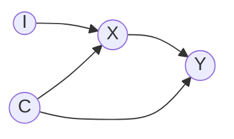

# Methods Continue

| Site | SNPs `G` | Exposure `X` | Outcome `Y` | Confounders `C` |
|---|---|---|---|---|
| Biobank A | yes | yes | yes | **yes** |
| Biobank B | yes | yes | yes | no |

Causal diagram (the same at both sites):

`I` are the SNPs, `X` the exposure, `Y` the outcome and `C` the confounders of `X` and `Y`.
The instrument is `S = G·w`; it stands in `I`'s place, so the design needs `S ⊥ C`.

Biobank A uses `C` to build a polygenic risk score (PRS) `S = I·w` that predicts `X`
but is (approximately) independent of `C`. Biobank B cannot check that independence
itself, so it relies on the certificate issued by A. Only the weights `w`, the
certificate, and model parameters ever leave a site; individual-level data stays put.