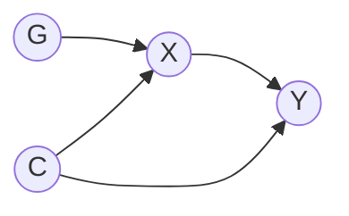
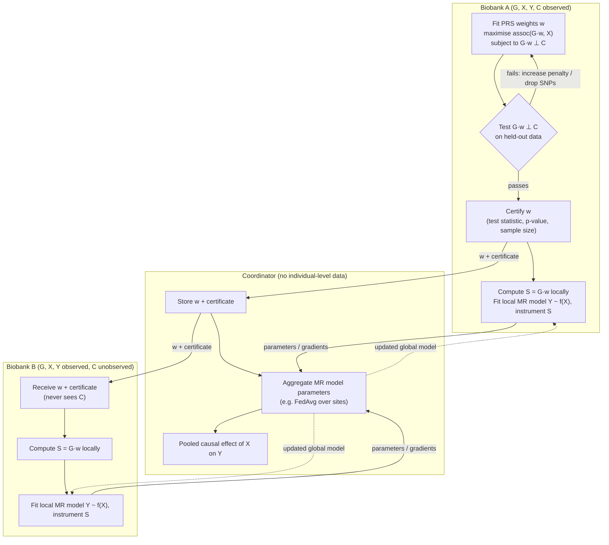

# Federated Mendelian randomisation across multiple biobanks

Mendelian randomisation models in a federated manner.

- Non-linear Mendelian randomisation models for each local node
- Federated learning on the shared models

## Setting

| Site | SNPs `G` | Exposure `X` | Outcome `Y` | Confounders `C` |
|---|---|---|---|---|
| Biobank A | yes | yes | yes | **yes** |
| Biobank B | yes | yes | yes | no |

Causal diagram (the same at both sites):

`G` are the SNPs, `X` the exposure, `Y` the outcome and `C` the confounders of `X` and `Y`.
The instrument is `S = G·w`; it stands in `G`'s place, so the design needs `S ⊥ C`.

Biobank A uses `C` to build a polygenic risk score (PRS) `S = G·w` that predicts `X`
but is (approximately) independent of `C`. Biobank B cannot check that independence
itself, so it relies on the certificate issued by A. Only the weights `w`, the
certificate, and model parameters ever leave a site; individual-level data stays put.

## Flow chart

## What crosses the network

| From | To | Payload |
|---|---|---|
| A | coordinator | PRS weights `w`, independence certificate |
| coordinator | B | PRS weights `w`, independence certificate |
| A, B | coordinator | local MR model parameters or gradients, each round |
| coordinator | A, B | aggregated MR model, each round |

Never: raw `G`, `X`, `Y`, or `C` from any site.

## Assumptions to state

1. **Transportability of the certificate.** `S ⊥ C` is tested in A's population. For it
   to hold in B, the joint distribution of `(G, C)` must be the same (or close enough)
   across biobanks, e.g. same ancestry and comparable recruitment.
2. **Relevance.** `S` predicts `X` in both biobanks, not just in A. Can be checked locally
   at B without confounders.
3. **Exclusion restriction.** `S` affects `Y` only through `X`; the independence step
   addresses confounding but not horizontal pleiotropy.

## Possible extension

The "predicts `X`" part of the PRS fit only needs `(G, X)`, which both sites have. That
step could itself be federated (both sites contribute gradients of the prediction loss),
while the independence penalty is contributed by A alone. The chart above keeps the PRS
fit entirely at A for simplicity.

