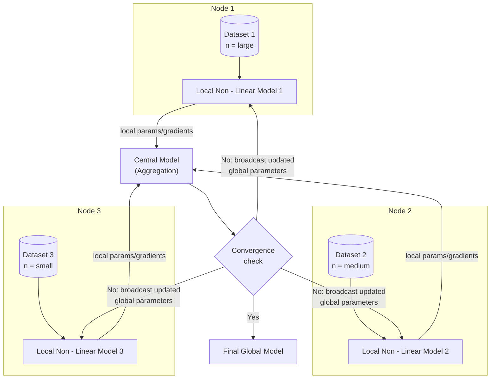

# Main Idea

Federated learning framework in which each participating site trains a local
linear model on its own dataset (datasets differ in sample size). Local model
updates are sent to a central model, which aggregates them into a global
model. The global model is then pushed back to each node to refine/initialize
the next round of local training. This repeats over several communication
rounds until the central model converges.

